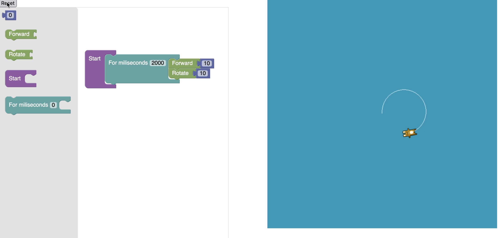

# Collaborative Blockly VM Example

## Purpose

This app shows an example of how Blockly blocks can be compiled into logo instructions, which are then run on a virtual machine. In this case, the blocks control an example sprite that has the same capabilities as the logo turtle (moving forward, backwards, rotating, and drawing with the pen), which is rendered using PixiJS. 




In its current iteration, it includes blocks to control a sprite to move forward, rotate, and repeat a list of instructions for a specified number of miliseconds.

## Quick Start

1. [Install](https://docs.npmjs.com/downloading-and-installing-node-js-and-npm) npm if you haven't before.
2. Run [`npx @blockly/create-package app <application-name>`](https://www.npmjs.com/package/@blockly/create-package) to clone this application to your own machine.
3. Run `npm install` to install the required dependencies.
4. Run `npm run start` to run the development server and see the app in action.
5. If you make any changes to the source code, just refresh the browser while the server is running to see them.

## Key Files and Structure

All paths in this documentation are local to the `src` directory.

`index.js` is the main file that handles the creation of the interface, including the Blockly workspace/toolbar and the PixiJS app for rendering sprites.

### Block Interface

All custom (i.e. not included with Blockly) blocks are described in `blocks/json.js`. JSON for new blocks can be created using the [Blockly Block Factory](https://google.github.io/blockly-samples/examples/developer-tools/index.html). To add these blocks to the toolbar in the app, add the `toolbox` object in `toolbox.js`. `index.js` uses the `toolbox.js` object to initialize the Blockly workspace. 

Please note that adding blocks to `blocks/json.js` and to `toolbox.js` only adds new blocks to the interface. For these blocks to be compiled correctly, they must be added to the generator (described below).

### Generator and Virtual Machine

Blocks are compiled into Logo opcodes using a custom logo generator in `generators/logo.js`. This generator works by mapping the name of a block to functions to turn block objects into a comma-separated string of Logo opcodes in the generator's forBlock attribute, e.g.:

```
logoGenerator.forBlock['<name of block>'] = function (block, generator) {
  ... convert block into code string ....
  return code;
};
```

Further details about implementing custom generators in Blockly can be found in [this tutorial](https://blocklycodelabs.dev/codelabs/custom-generator/index.html?index=..%2F..index#0). 

One improvement that could be made to the generator is generating an array of opcodes instead of a string. Unfortunately, from a readthrough of the [generator class](https://github.com/google/blockly/blob/develop/core/generator.ts), it seems that it only supports generators that produce strings.

For this reason, the `run` function in `vm.js` first parses the string into an array of integer op codes, then calls `run_instruction` on that array of opcodes.

The `run` function returns a callback function which executes a single instruction. Currently, in `index.js` this callback function is passed into the sprite to be called each time the sprite is redrawn. This is a temporary fix to allow the sprite to be drawn as execution of commands occurs, as just executing the code separately from the PixiJS app causes rendering to only occur after all the code is run. For this reason, it is necessary for timed blocks like the `for_miliseconds` block to work. However, this means execution is *much slower* than it should be, as it only executes one instruction each frame. Further investigation of the [PixiJS documentation](https://pixijs.download/release/docs/index.html) (and most likely the source code as well) is needed to fix this code.


### Sprite Rendering

Rendering is done via PixiJS. The current sprite is called `TurtleSprite` (although it is currently rendered as the default PixiJS rabbit) because it has the same capabilities as the Logo turtle. The class can be found in `turtle_sprite.js`. It currently has functions to move forward, backward, and rotate implemented. The "Reset" button calls `reset_turtle` (which stops all execution and rendering and returns the sprite to its default position/orientation). The "Run" button takes the function created from the `run` function in `vm.js` (see above) and passes it in to `start_turtle`, which adds a callback to both execute an instruction and render the sprite at each frame.

## Serving

To run your app locally, run `npm run start` to run the development server. This mode generates source maps and ingests the source maps created by Blockly, so that you can debug using unminified code.

To deploy your app so that others can use it, run `npm run build` to run a production build. This will bundle your code and minify it to reduce its size. You can then host the contents of the `dist` directory on a web server of your choosing. If you're just getting started, try using [GitHub Pages](https://pages.github.com/).


## Current Areas for Improvement
Before further developing this into a collaborative application, there are some changes that should be made.

Higher Effort:

- [ ] Separating VM execution and rendering while having execution and rendering still happen simultaenously
- [ ] Adding key primitive VM instructions (LGET, LSET, UFUN) and corresponding blocks
- [ ] Maybe not immediately necessary: directly generating an integer array of opcodes instead of string (may need to modify Blockly's [generator.ts](https://github.com/google/blockly/blob/develop/core/generator.ts)).

Lower Effort:
- [ ] Adding blocks for simpler commands: 
  - [ ] Backward
  - [ ] Pen up/down


